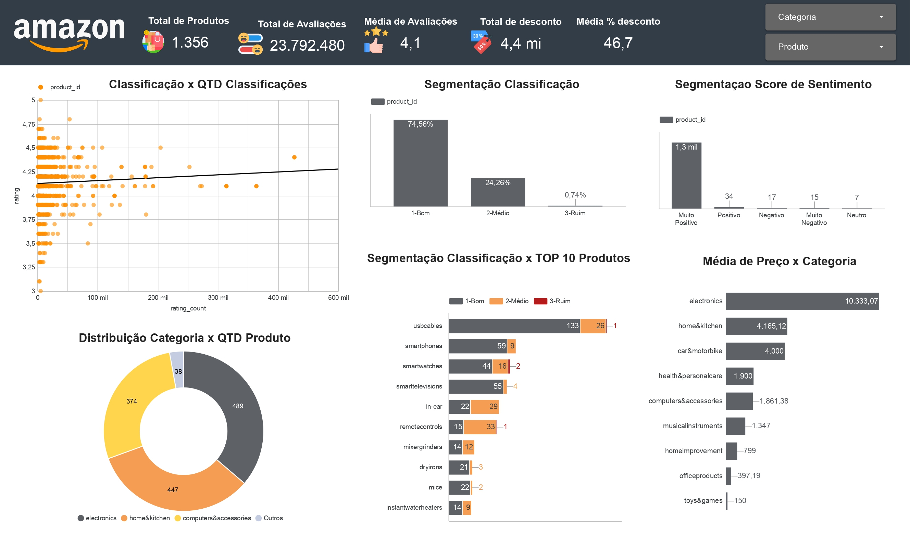
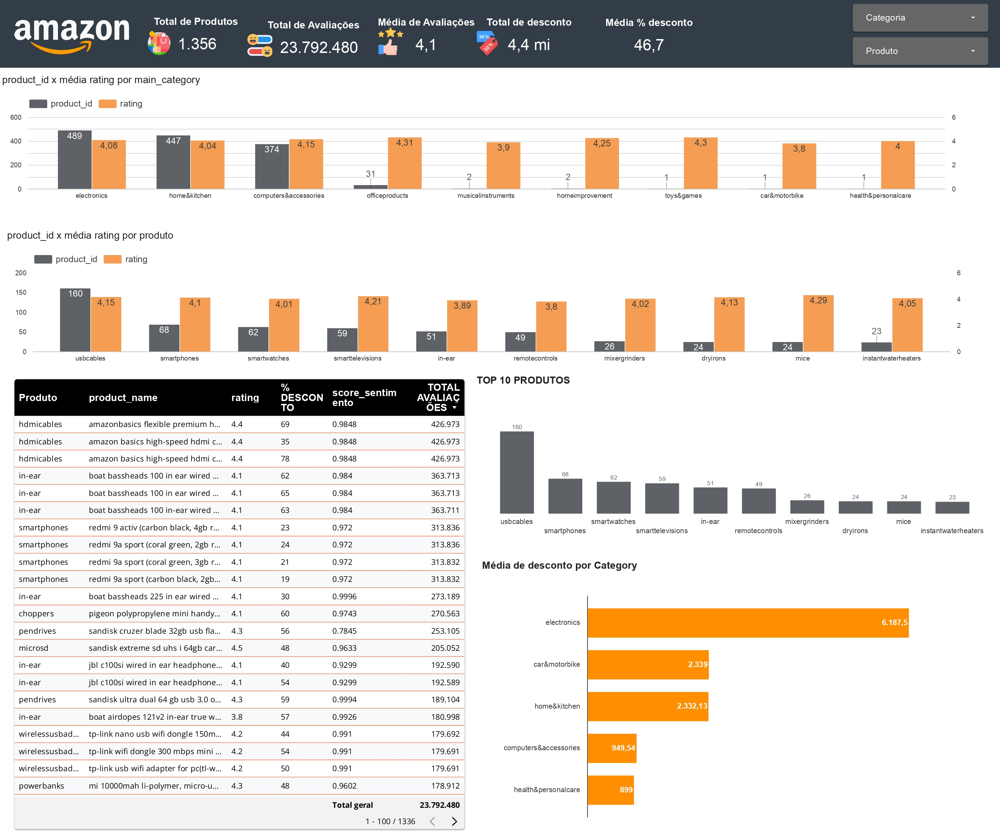

# Projeto 04: Análise de Dados Amazon Sales

**Equipe:** Ana Virgínia Morais e Juliana Marinho Xavier

## 📋 Introdução

Este relatório apresenta os resultados de uma análise exploratória e de validação de hipóteses sobre um conjunto de dados de produtos e avaliações da Amazon. O objetivo principal foi investigar a relação entre descontos, popularidade e a qualidade percebida dos produtos.

### 🔗 Links Importantes
* **Apresentação:** [Google Slides](https://docs.google.com/presentation/d/1z9FMRw8Uh7r-ALzcFmke2FsVNmVD1QkRCeu-M0mREB0/edit?slide=id.p#slide=id.p)
* **Google Colab (Notebook):** [Acessar Código](https://colab.research.google.com/drive/1iCQgxWGuhup4gdUeKhO9YPAIYr1l6rAQ#scrollTo=DThDoJ6Q30UC)
* **Dashboard Interativo:** [Looker Studio](https://lookerstudio.google.com/reporting/c79f26b0-1416-4216-ade1-0e9d1f8ef07b/page/9VKYF)

---

## 📊 Dashboard

Abaixo, uma visualização geral dos dados analisados no Looker Studio:

---

## 🛠 Ferramentas e Tecnologias

### Ferramentas
* **Google Colab:** Para desenvolvimento e execução do código Python.
* **Gemini/ChatGPT:** Utilizados como assistentes de codificação e revisão.
* **Looker Studio:** Para construção do dashboard interativo.
* **Google Slides:** Para apresentação dos resultados.

### Linguagem
* **Python:** Linguagem principal utilizada para manipulação de dados, análise estatística e visualização.

---

## 📂 Base de Dados (Amazon Sales)

O conjunto de dados contém mais de 1.000 classificações e análises de produtos da Amazon, obtidos via Kaggle. A análise foca em entender o processo desde a precificação até a percepção do cliente.

### Dicionário de Variáveis

**Tabela `amazon_product`**
* `product_id`: ID do produto
* `product_name`: Nome do produto
* `category`: Categoria do produto
* `discounted_price`: Preço com desconto
* `actual_price`: Preço real
* `discount_percentage`: Porcentagem de desconto
* `about_product`: Descrição do produto

**Tabela `amazon_review`**
* `user_id`: ID do usuário
* `user_name`: Nome do usuário
* `Review_id`: ID da avaliação
* `Review_title`: Título da avaliação
* `Review_content`: Conteúdo completo da avaliação
* `Rating`: Classificação do produto (Nota)
* `Rating_count`: Contagem de avaliações (Popularidade)

---

## 🚀 Conclusões e Validação de Hipóteses

Durante o projeto, foram realizados testes estatísticos (Shapiro-Wilk, Mann-Whitney U, Correlação de Spearman) para validar três hipóteses principais.

### 1. Descontos vs. Qualidade Percebida (Hipótese Refutada)
* **Hipótese:** Produtos com maior desconto são melhor classificados?
* **Resultado:** **Não.** A hipótese foi refutada.
* **Análise:** Existe uma correlação negativa fraca (-0.15). Produtos com grandes descontos tendem a ter avaliações ligeiramente piores. [cite_start]O Risco Relativo mostrou que o risco de ter uma nota alta (≥4.5) é menor para produtos com grandes descontos[cite: 3124, 3125].

### 2. Sentimento vs. Classificação (Hipótese Confirmada)
* **Hipótese:** Avaliações com texto positivo resultam em notas maiores?
* **Resultado:** **Sim.**
* [cite_start]**Análise:** O risco de um produto ter uma nota alta (≥4.5) é **1.34 vezes maior** quando o sentimento da avaliação é positivo[cite: 3111, 3112].

### 3. Popularidade vs. Classificação (Hipótese Confirmada)
* **Hipótese:** Produtos com mais avaliações (mais populares) são melhor classificados?
* **Resultado:** **Sim.**
* **Análise:** Produtos populares têm uma probabilidade significativamente maior de serem bem avaliados. [cite_start]O Risco Relativo indica que produtos com mais avaliações têm **1.09 vezes** mais chance de ter notas altas[cite: 3114, 3115].

---

## 💡 Insights Essenciais

1.[cite_start]**Desconto não garante satisfação:** Clientes podem interpretar descontos excessivos como sinal de baixa qualidade ou inflação do preço original[cite: 3126].
2.[cite_start]**Popularidade é sinal de qualidade:** Produtos com alto volume de vendas/avaliações tendem a manter uma consistência de qualidade superior[cite: 3127].
3.[cite_start]**Consistência das Notas:** A maioria dos produtos mantém uma média entre 4.0 e 4.5 estrelas, indicando uma qualidade percebida uniforme na plataforma[cite: 3131].
4.[cite_start]**Extremos:** O dataset possui uma grande base de produtos baratos com poucas avaliações e uma minoria de produtos caros e extremamente populares[cite: 3130].

---

## 📢 Recomendações de Negócio

Com base nos dados, sugerimos as seguintes estratégias:

*[cite_start]**Reavaliar Estratégia de Descontos:** Evitar descontos agressivos como única ferramenta de atração, pois podem prejudicar a percepção de valor da marca.
*[cite_start]**Focar na Popularidade:** Investir em marketing e campanhas que incentivem os clientes a deixarem avaliações, pois o volume de reviews é um forte validador de qualidade para novos compradores.